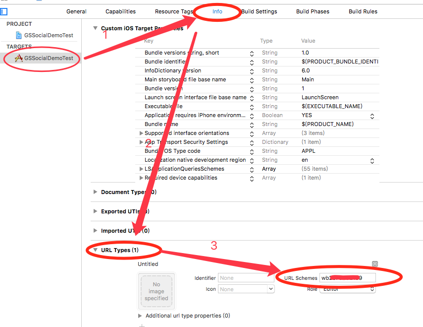
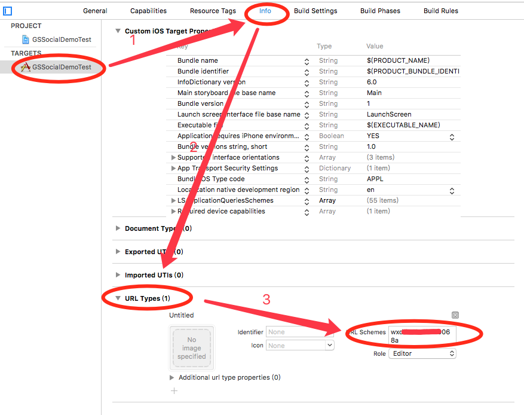
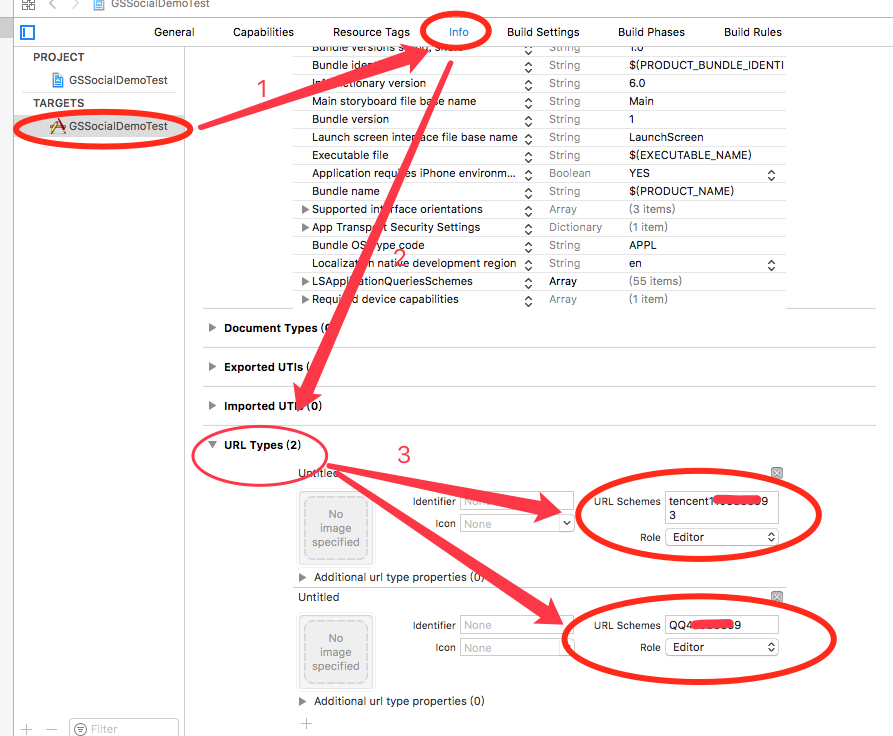

## SocialSDK
实现sina wechat qq 登录和分享功能
## SDK功能
| 渠道 | 分享 | 登录 | 支付 |
|:--------------------:|:---------------------------:|:----------------------------:|:----------------------------:|
| Sina | ✔️ | ✔️ | ✖️ |
| QQ | ✔️ | ✔️ | ✖️ |
| Wechat | ✔️ | ✔️ | ✖️ |
## 分享平台支持
| 渠道 | 纯文本 | 单图 | 普通链接 | 音频链接 | 视频链接 |
|:--------------------:|:---------------------------:|:----------------------------:|:----------------------------:|:----------------------------:|:-------------------------------------------------------------------------:|
| Sina | ✔️ | ✔️ | ✔️ | ✔️ | ✔️  |
| QQ | ✔️ | ✔️ | ✔️ | ✔️ | ✔️  |
| Qzone | ✔️ | ✔️ | ✔️ | ✔️ | ✔️  |
| WechatSession | ✔️ | ✔️ | ✔️ | ✔️ | ✔️  |
| WechatTimeLine | ✔️ | ✔️ | ✔️ | ✔️ | ✔️  |
## 平台配置
#### [SinaWeiBo](#SinaWeiBo)  [WeChat](#WeChat)  [QQ/Qzone](#QQ)
### <a id="SinaWeiBo"></a>SinaWeiBo平台配置
* *1、* 添加URL Schemes 格式"wb"+新浪appKey  
* 
* *2、* [适配iOS9+系统](#iOS9+)

### <a id="WeChat"></a>WeChat平台配置
* *1、* 添加URL Schemes 格式 微信appKey  
*   
* *2、* [适配iOS9+系统](#iOS9+)

### <a id="QQ"></a>QQ/Qzone平台配置
* *1、* 添加URL Schemes  
* 格式"tencent"+QQ的appID + "QQ"+QQ的appID转换成十六进制（不足8位前面补0) [在线转换十六进制](http://tool.oschina.net/hexconvert/) 
* 例如: appID:100424468 --> tencent100424468  QQ05fc5b14
*   
* *2、*[适配iOS9+系统](#iOS9+)

## Installation
手动添加Classes文件中的类。
### CocoaPods
```ruby
pod 'SocialSDK', '~> 0.0.1'
```
问题如果podfile里面使用了`use_frameworks!`需要手动修改`Pods-TargetsName-resources.sh`文件(根据添加的平台和CONFIGURATION决定添加下面的语句):

```ruby
if [[ "$CONFIGURATION" == "Debug" ]]; then
  install_resource "SocialSDK/SocialSDK/Rrources/GSSocialSDKResources.bundle"
  install_resource "SocialSDK/SDK/TencentOpenApi/TencentOpenApi_IOS_Bundle.bundle"
  install_resource "SocialSDK/SDK/libWeiboSDK/WeiboSDK.bundle"
fi
if [[ "$CONFIGURATION" == "Release" ]]; then
  install_resource "SocialSDK/SocialSDK/Rrources/GSSocialSDKResources.bundle"
  install_resource "SocialSDK/SDK/TencentOpenApi/TencentOpenApi_IOS_Bundle.bundle"
  install_resource "SocialSDK/SDK/libWeiboSDK/WeiboSDK.bundle"
fi
```

也可以先去掉`use_frameworks!`拷贝出相应的`install_resource`命令来安装资源文件。
## <a id="iOS9+"></a>iOS9+适配
#### 1. HTTPS传输 在info.plist中加入安全域名白名单(右键info.plist用source code打开)
```objc
<key>NSAppTransportSecurity</key>
<dict>
    <key>NSExceptionDomains</key>
    <dict>
        <key>sina.cn</key>
        <dict>
            <key>NSIncludesSubdomains</key>
            <true/>
            <key>NSThirdPartyExceptionRequiresForwardSecrecy</key>
            <false/>
            <key>NSExceptionMinimumTLSVersion</key>
            <string>TLSv1.0</string>
        </dict>
        <key>weibo.cn</key>
        <dict>
            <key>NSIncludesSubdomains</key>
            <true/>
            <key>NSThirdPartyExceptionRequiresForwardSecrecy</key>
            <false/>
            <key>NSExceptionMinimumTLSVersion</key>
            <string>TLSv1.0</string>
        </dict>
        <key>weibo.com</key>
        <dict>
            <key>NSIncludesSubdomains</key>
            <true/>
            <key>NSThirdPartyExceptionAllowsInsecureHTTPLoads</key>
            <true/>
            <key>NSExceptionMinimumTLSVersion</key>
            <string>TLSv1.0</string>
            <key>NSThirdPartyExceptionRequiresForwardSecrecy</key>
            <false/>
        </dict>
        <key>sinaimg.cn</key>
        <dict>
            <key>NSIncludesSubdomains</key>
            <true/>
            <key>NSThirdPartyExceptionAllowsInsecureHTTPLoads</key>
            <true/>
   			  <key>NSExceptionMinimumTLSVersion</key>
            <string>TLSv1.0</string>
            <key>NSThirdPartyExceptionRequiresForwardSecrecy</key>
            <false/>
        </dict>
        <key>sinajs.cn</key>
        <dict>
            <key>NSIncludesSubdomains</key>
            <true/>
            <key>NSThirdPartyExceptionAllowsInsecureHTTPLoads</key>
            <true/>
            <key>NSExceptionMinimumTLSVersion</key>
            <string>TLSv1.0</string>
            <key>NSThirdPartyExceptionRequiresForwardSecrecy</key>
            <false/>
        </dict>
        <key>sina.com.cn</key>
        <dict>
            <key>NSIncludesSubdomains</key>
            <true/>
            <key>NSThirdPartyExceptionAllowsInsecureHTTPLoads</key>
            <true/>
            <key>NSExceptionMinimumTLSVersion</key>
            <string>TLSv1.0</string>
            <key>NSThirdPartyExceptionRequiresForwardSecrecy</key>
            <false/>
        </dict>
    </dict>
</dict>
```
#### 2.配置ApplicationQueriesSchemes(应用间跳转)
```objc
<key>LSApplicationQueriesSchemes</key>
<array>
    <!-- 微信 URL Scheme 白名单-->
    <string>wechat</string>
    <string>weixin</string>

    <!-- 新浪微博 URL Scheme 白名单-->
    <string>sinaweibohd</string>
    <string>sinaweibo</string>
    <string>weibosdk</string>
    <string>weibosdk2.5</string>

    <!-- QQ、Qzone URL Scheme 白名单-->
    <string>mqqapi</string>
    <string>mqq</string>
    <string>mqqOpensdkSSoLogin</string>
    <string>mqqconnect</string>
    <string>mqqopensdkdataline</string>
    <string>mqqopensdkgrouptribeshare</string>
    <string>mqqopensdkfriend</string>
    <string>mqqopensdkapi</string>
    <string>mqqopensdkapiV2</string>
    <string>mqqopensdkapiV3</string>
    <string>mqqopensdkapiV4</string>
    <string>mqzoneopensdk</string>
    <string>wtloginmqq</string>
    <string>wtloginmqq2</string>
    <string>mqqwpa</string>
    <string>mqzone</string>
    <string>mqzonev2</string>
    <string>mqzoneshare</string>
    <string>wtloginqzone</string>
    <string>mqzonewx</string>
    <string>mqzoneopensdkapiV2</string>
    <string>mqzoneopensdkapi19</string>
    <string>mqzoneopensdkapi</string>
    <string>mqqbrowser</string>
    <string>mttbrowser</string>
</array>
```
## Renderings
纯文本分享：</br>
</br>
单图分享：</br>
</br>
URL分享：</br>
</br>
## License
SocialSDK is under [WTFPL](http://www.wtfpl.net/). You can do what the fuck you want with SocialSDK. See [LICENSE](LICENSE) file for more info.
