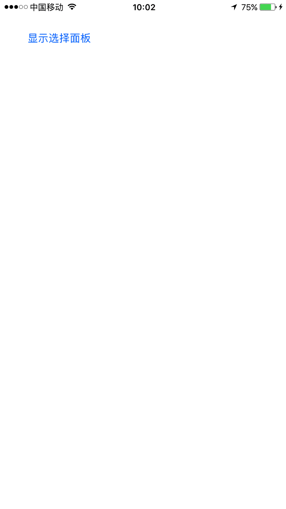

## SocialSDK
 **简介:** 实现 **Sina** **WeChat** **QQ** 登录和分享功能
### 1. SDK功能
| 平台 | 分享 | 登录 | 支付 |
|:--------------------:|:---------------------------:|:----------------------------:|:----------------------------:|
| Sina | √ | √ | × |
| QQ | √ | √ | × |
| Wechat | √ | √ | × |
### 2.分享渠道支持
| 渠道 | 纯文本 | 单图 | 普通链接 | 音频链接 | 视频链接 |
|:--------------------:|:---------------------------:|:----------------------------:|:----------------------------:|:----------------------------:|:-------------------------------------------------------------------------:|
| Sina | √ | √ | √ | √ | √  |
| QQ | √ | √ | √ | √ | √  |
| Qzone | √ | √ | √ | √ | √  |
| WechatSession | √ | √ | √ | √ | √  |
| WechatTimeLine | √ | √ | √ | √ | √  |
## Renderings
### 纯文本、单图、URL、音频链接、视频链接分享
    
    
    
    
    
### 微博登录
    
## 平台集成  
### 1. SocialSDK集成  
* 1.1 [通过Cocoapods集成](#CocoaPods集成)
* 1.2 [手动集成](#手动集成介绍)
  
### 2. SocialSDK各平台配置
* 2.1 [Sina](#SinaWeiBo)
* 2.2 [WeChat](#WeChat)
* 2.3 [QQ](#QQ)

### 3. 调用SocialSDK
* 3.1 [初始化配置](#初始化配置)
* 3.2 [第三方平台登录](#第三方平台登录)
* 3.3 [第三方平台分享](#第三方平台分享)

***
## Installation
### <a id="CocoaPods集成"></a>CocoaPods
编写`podfile`分为是否使用了`use_frameworks!`两种情况</br>

1.如果没使用`use_frameworks!`
```ruby
pod 'SocialSDK'
```
2.使用了`use_frameworks!`
```ruby
pod 'SocialSDK_UF'
pod 'SocialSDK_R'
```
### <a id="手动集成介绍"></a>手动集成介绍
直接拖动Classes文件到自己的项目中，添加Resources中的资源文件（推荐使用CocoaPods）。
## SocialSDK各平台配置
#### <a id="SinaWeiBo"></a>Sina平台配置
* *1、* 添加URL Schemes 格式"wb"+新浪appKey  
* 
* *2、* [适配iOS9+系统](#iOS9+)

#### <a id="WeChat"></a>WeChat平台配置
* *1、* 添加URL Schemes 格式 微信appKey  
*   
* *2、* [适配iOS9+系统](#iOS9+)

#### <a id="QQ"></a>QQ平台配置
* *1、* 添加URL Schemes  
* 格式"tencent"+QQ的appID + "QQ"+QQ的appID转换成十六进制（不足8位前面补0) [在线转换十六进制](http://tool.oschina.net/hexconvert/) 
* 例如: appID:100424468 --> tencent100424468  QQ05fc5b14
*   
* *2、*[适配iOS9+系统](#iOS9+)


### <a id="iOS9+"></a>iOS9+适配
#### 1. HTTPS传输 在info.plist中加入安全域名白名单(右键info.plist用source code打开)
```objc
<key>NSAppTransportSecurity</key>
<dict>
    <key>NSExceptionDomains</key>
    <dict>
        <key>sina.cn</key>
        <dict>
            <key>NSIncludesSubdomains</key>
            <true/>
            <key>NSThirdPartyExceptionRequiresForwardSecrecy</key>
            <false/>
            <key>NSExceptionMinimumTLSVersion</key>
            <string>TLSv1.0</string>
        </dict>
        <key>weibo.cn</key>
        <dict>
            <key>NSIncludesSubdomains</key>
            <true/>
            <key>NSThirdPartyExceptionRequiresForwardSecrecy</key>
            <false/>
            <key>NSExceptionMinimumTLSVersion</key>
            <string>TLSv1.0</string>
        </dict>
        <key>weibo.com</key>
        <dict>
            <key>NSIncludesSubdomains</key>
            <true/>
            <key>NSThirdPartyExceptionAllowsInsecureHTTPLoads</key>
            <true/>
            <key>NSExceptionMinimumTLSVersion</key>
            <string>TLSv1.0</string>
            <key>NSThirdPartyExceptionRequiresForwardSecrecy</key>
            <false/>
        </dict>
        <key>sinaimg.cn</key>
        <dict>
            <key>NSIncludesSubdomains</key>
            <true/>
            <key>NSThirdPartyExceptionAllowsInsecureHTTPLoads</key>
            <true/>
   			  <key>NSExceptionMinimumTLSVersion</key>
            <string>TLSv1.0</string>
            <key>NSThirdPartyExceptionRequiresForwardSecrecy</key>
            <false/>
        </dict>
        <key>sinajs.cn</key>
        <dict>
            <key>NSIncludesSubdomains</key>
            <true/>
            <key>NSThirdPartyExceptionAllowsInsecureHTTPLoads</key>
            <true/>
            <key>NSExceptionMinimumTLSVersion</key>
            <string>TLSv1.0</string>
            <key>NSThirdPartyExceptionRequiresForwardSecrecy</key>
            <false/>
        </dict>
        <key>sina.com.cn</key>
        <dict>
            <key>NSIncludesSubdomains</key>
            <true/>
            <key>NSThirdPartyExceptionAllowsInsecureHTTPLoads</key>
            <true/>
            <key>NSExceptionMinimumTLSVersion</key>
            <string>TLSv1.0</string>
            <key>NSThirdPartyExceptionRequiresForwardSecrecy</key>
            <false/>
        </dict>
    </dict>
</dict>
```
#### 2.配置ApplicationQueriesSchemes(应用间跳转)
```objc
<key>LSApplicationQueriesSchemes</key>
<array>
    <!-- 微信 URL Scheme 白名单-->
    <string>wechat</string>
    <string>weixin</string>

    <!-- 新浪微博 URL Scheme 白名单-->
    <string>sinaweibohd</string>
    <string>sinaweibo</string>
    <string>weibosdk</string>
    <string>weibosdk2.5</string>

    <!-- QQ、Qzone URL Scheme 白名单-->
    <string>mqqapi</string>
    <string>mqq</string>
    <string>mqqOpensdkSSoLogin</string>
    <string>mqqconnect</string>
    <string>mqqopensdkdataline</string>
    <string>mqqopensdkgrouptribeshare</string>
    <string>mqqopensdkfriend</string>
    <string>mqqopensdkapi</string>
    <string>mqqopensdkapiV2</string>
    <string>mqqopensdkapiV3</string>
    <string>mqqopensdkapiV4</string>
    <string>mqzoneopensdk</string>
    <string>wtloginmqq</string>
    <string>wtloginmqq2</string>
    <string>mqqwpa</string>
    <string>mqzone</string>
    <string>mqzonev2</string>
    <string>mqzoneshare</string>
    <string>wtloginqzone</string>
    <string>mqzonewx</string>
    <string>mqzoneopensdkapiV2</string>
    <string>mqzoneopensdkapi19</string>
    <string>mqzoneopensdkapi</string>
    <string>mqqbrowser</string>
    <string>mttbrowser</string>
</array>
```
## <a id="初始化配置"></a>初始化配置  

 在 `AppDelegate.m` 中做如下配置

```objc
   #import "GSPlatformParamConfigManager.h"
   #import "GSSocialManager.h"
   
 - (BOOL)application:(UIApplication *)application didFinishLaunchingWithOptions:(NSDictionary *)launchOptions 
{
    [[GSPlatformParamConfigManager share] addSinaPlatformConfigAppKey:@"" redirectURI:@""];
    [[GSPlatformParamConfigManager share] addQQPlatformConfigAppID:@""];
    [[GSPlatformParamConfigManager share] addWeChatPlatformConfigAppID:@"" secret:@""];
    return YES;
}

- (BOOL)application:(UIApplication *)app openURL:(NSURL *)url options:(NSDictionary<UIApplicationOpenURLOptionsKey,id> *)options
{
    BOOL res = [[GSSocialManager share] handleOpenURL:url];
    if (!res) {
        //做其他SDK回调处理
    }
    return res;
}

- (BOOL)application:(UIApplication *)application handleOpenURL:(NSURL *)url
{
    BOOL res = [[GSSocialManager share] handleOpenURL:url];
    if (!res) {
        //做其他SDK回调处理
    }
    return res;
}

```
## <a id="第三方平台登录"></a>第三方平台登录  

  ```objc
#import "GSSelectView.h"
#import "GSShareChannelType.h"
#import "GSLoginManager.h"

  ```  
  
  ```objc
      [GSSelectView showShareViewWithChannels:@[
                                              @(GSShareChannelTypeSina),
                                              @(GSShareChannelTypeQQ),
                                              @(GSShareChannelTypeQzone),
                                              @(GSShareChannelTypeWechatSession)
                                              ] completionBlock:^(BOOL isCancel, GSLogoReourcesType reourcesType) {
                                                  if (isCancel) {
                                                      
                                                  } else {
                                                      id<GSLoginProtocol> login = [[GSLoginManager share] getShareProtocolWithChannelType:[GSLoginManager getShareChannelTypeWithLogoReourcesType:reourcesType]];
                                                      [login setLoginCompletionBlock:^(id<GSLoginResultProtocol> result) {
                                                          
                                                      }];
                                                      [login doLogin];
                                                  }
    }];
  
  ```
  
## <a id="第三方平台分享"></a>第三方平台分享

```objc
#import "GSSelectView.h"
#import "GSShareChannelType.h"
#import "GSShareManager.h"
```
```objc
    [GSSelectView showShareViewWithChannels:@[
                                              @(GSShareChannelTypeSina),
                                              @(GSShareChannelTypeQQ),
                                              @(GSShareChannelTypeQzone),
                                              @(GSShareChannelTypeWechatSession)
                                              ] completionBlock:^(BOOL isCancel, GSLogoReourcesType reourcesType) {
                                                  if (isCancel) {
                                                      
                                                  } else {
                                                      id<GSShareProtocol> share = [[GSShareManager share] getShareProtocolWithChannelType:[GSShareManager getShareChannelTypeWithLogoReourcesType:reourcesType]];
                                                      [share shareSimpleText:@"good day"];
                                                      [share setShareCompletionBlock:^(id<GSShareResultProtocol> result) {
                                                          
                                                      }];
                                                  }
    }];
```
## 联系方式
QQ：470058952</br>
我的微信：</br>

## License
SocialSDK is under [WTFPL](http://www.wtfpl.net/). You can do what the fuck you want with SocialSDK. See [LICENSE](LICENSE) file for more info.
